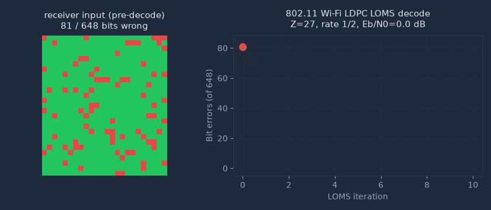
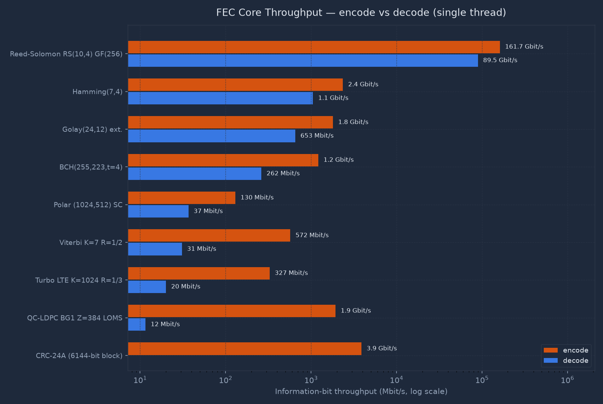
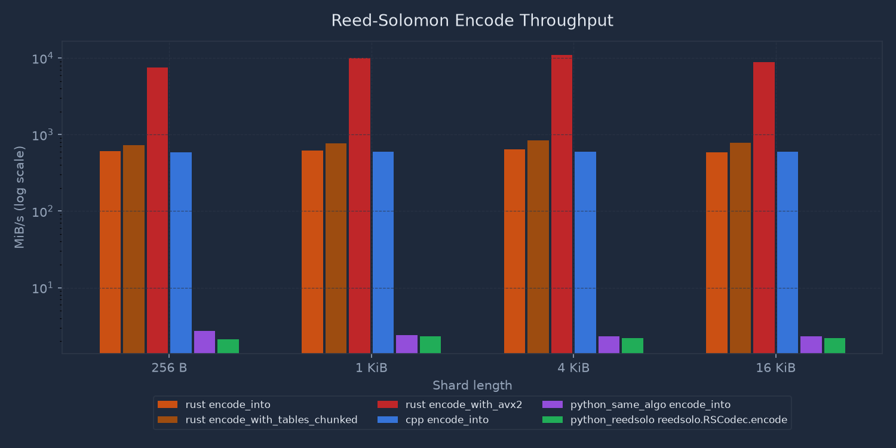
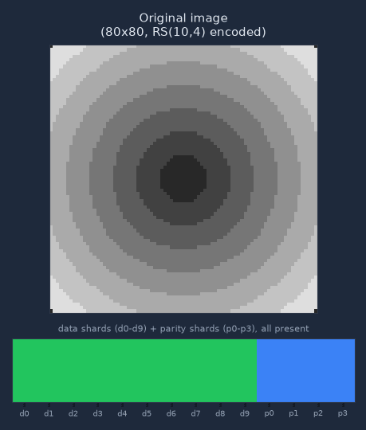
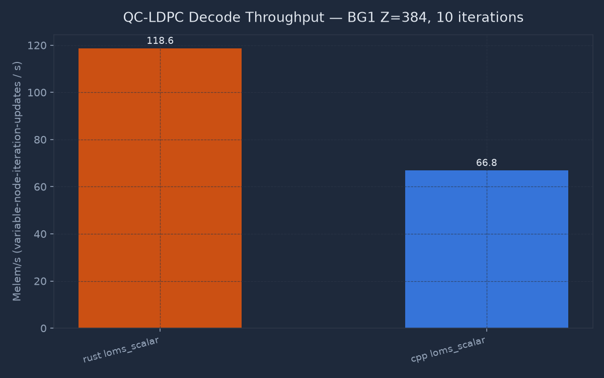
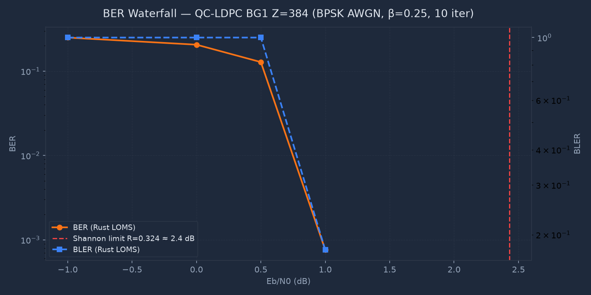
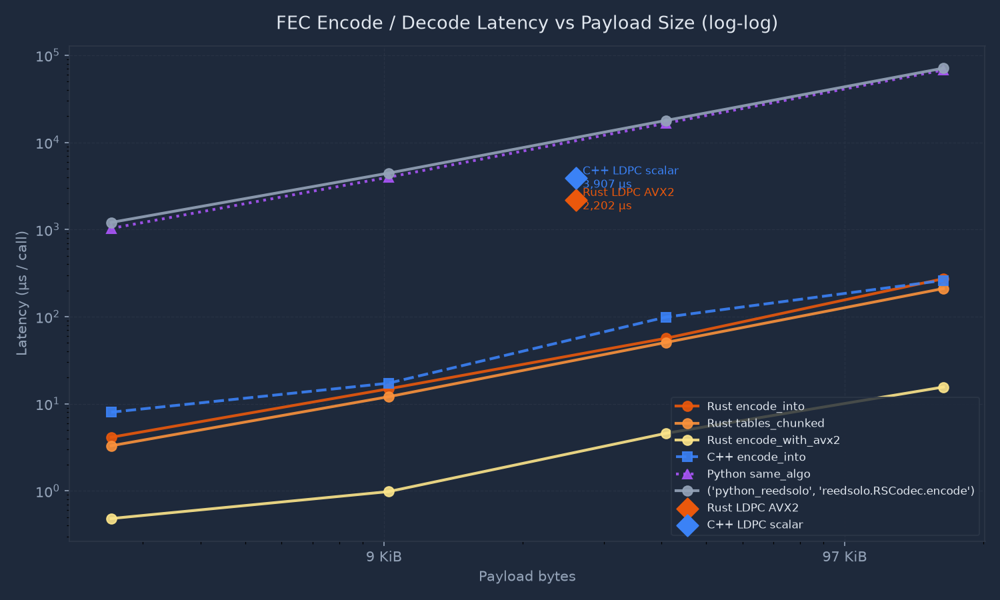

# syndrome

[](https://github.com/ThomasGl/syndrome/actions/workflows/ci.yml)
[](LICENSE)
[](https://www.rust-lang.org/)
[](tests/)
[](examples/)
[](src/transport_block.rs)
[](src/wifi.rs)
[](src/sixg.rs)

**A high-performance, multi-standard Forward Error Correction library in safe Rust — nine FEC cores spanning every wireless generation: Hamming and Golay (the classics), BCH and Reed-Solomon (storage and satellites), convolutional/Viterbi (2G), Turbo (3G/4G LTE), and QC-LDPC + Polar (5G NR TS 38.212, Wi-Fi 6/7, 6G research) — with AVX2/NEON SIMD, lock-free pipelining, runnable teaching examples, and end-to-end media reconstruction tests.**



*A real 802.11ax/be Wi-Fi LDPC codeword (Z=27, rate 1/2, 648 bits), encoded by
this crate, sent through a simulated BPSK/AWGN channel at 0.0 dB Eb/N0 (96
bits corrupted), and decoded by the layered offset min-sum kernel in
[`src/qc_ldpc.rs`](src/qc_ldpc.rs). Every frame is a hard-decision snapshot
taken after one real decode iteration — the bit-error count is the actual
Hamming distance to the codeword this program transmitted, not a synthetic
curve. The $(E_b/N_0, \text{seed})$ pair is chosen by sweeping real trials
until one is legible enough to animate, so this is a representative decode
rather than an average one; the trial itself is recorded exactly as it ran,
including the non-monotonic step where the error count rises before falling.
Generated by
[`src/bin/ldpc_convergence_export.rs`](src/bin/ldpc_convergence_export.rs) +
[`bench/dashboard/gen_convergence_gif.py`](bench/dashboard/gen_convergence_gif.py);
see [`bench/README.md`](bench/README.md#ldpc-convergence-gif) to regenerate.*



---

## At a Glance

| What | Detail |
|---|---|
| **Standards** | 3GPP TS 38.212 (5G NR), TS 36.212 (LTE Turbo), **802.11ax/be (Wi-Fi 6/7) — real LDPC encode/decode, all 12 Annex R/F matrices**, IMT-2030 (6G research) |
| **Algorithms** | 9 cores: Hamming, Golay, BCH, Reed-Solomon, Viterbi, Turbo, QC-LDPC LOMS, Polar SC/CA-SCL, CRC family |
| **SIMD** | AVX2 kernels in LDPC, RS, Viterbi, and Turbo (x86-64, runtime-detected, scalar-equivalence-tested); GFNI-accelerated GF(256) multiply for RS where available, AVX2 VPSHUFB nibble-table fallback elsewhere; NEON (AArch64) |
| **Concurrency** | Lock-free SPSC ring buffer, multi-worker LDPC pipeline, per-core affinity |
| **Tests** | 425 total on x86-64 (423 on AArch64: 7 AVX2/GFNI tests drop out, 5 NEON-only ones appear) — 235 unit (incl. multi-threaded SPSC stress + exhaustive Hamming H-matrix proof + exhaustive GFNI bit-matrix proof + χ² channel-normality test) · 12 integration (5G NR + Wi-Fi) · 4 LDPC offset-β validation · 4 media reconstruction · 14 reference vectors · 38 robustness · 118 doctests |
| **Examples** | 7 runnable, heavily-commented teaching examples (`cargo run --example …`) |
| **Allocations** | Zero heap allocation inside the decode hot-paths |
| **Benchmarks** | RS: ~162/90 Gbit/s encode/decode (GFNI, AVX2 VPSHUFB fallback), LDPC: ~219 Melem/s · all numbers from running code |

### The algorithm portfolio — one library, every generation

| Code | Introduced | Decoder here | Decode complexity | Where industry uses it | Key paper |
|---|---|---|---|---|---|
| **Hamming(7,4)** | 1950 | Syndrome lookup | $O(1)$ / nibble | ECC teaching, SECDED DRAM ancestor | Hamming 1950 |
| **Golay(24,12,8)** | 1949 | Syndrome table (2 325 cosets) | $O(1)$ / block | Voyager imaging, CCSDS telecommand, MIL-STD-188-141 ALE | Golay 1949 |
| **BCH(255,k,t≤10)** | 1959–60 | Berlekamp–Massey + Chien | $O(nt)$ | DVB-S2 outer code, NAND-flash controllers | Bose–Chaudhuri 1960; Hocquenghem 1959 |
| **Reed-Solomon GF(256)** | 1960 | Erasure (Cauchy matrix); errors-and-erasures (syndrome-verified search) | $O(n \cdot p)$ erasure; $O\!\big(\binom{n}{t} \cdot \text{len}\big)$ for $t$ unknown-position errors | QR codes, S3/Ceph storage, CD/Blu-ray, DVB | Reed & Solomon 1960 |
| **Convolutional (Viterbi)** | 1967 | Hard ACS + soft max-log-MAP; zero-terminated and tail-biting (WAVA) | $O(2^{K-1} L)$, $\times$ laps for tail-biting | GSM/2G, DAB radio, legacy 802.11, deep space | Viterbi 1967; Shao–Lin–Fossorier 2003 (WAVA) |
| **Turbo (LTE PCCC)** | 1993 | Iterative max-log-MAP (BCJR) | $O(8 K \cdot \text{iters})$ | 3G UMTS, 4G LTE data channels | Berrou et al. 1993 |
| **QC-LDPC (BG1/BG2)** | 1963 / 2004 | Layered Offset Min-Sum, SIMD | $O(E Z \cdot \text{iters})$ | 5G NR data, Wi-Fi 6/7, DVB-S2X, 10GBASE-T | Gallager 1963; Fossorier 2004 |
| **Polar (SC / CA-SCL)** | 2009 | Successive cancellation + list | $O(N \log N)$, list $\times L$ | 5G NR control channels (PDCCH/PBCH) | Arıkan 2009; Tal & Vardy 2015 |
| **CRC-24A/B/C, 16/11/6** | 1961 | Detection only | $O(n)$ | Every 3GPP standard, Ethernet, ZIP | Peterson & Brown 1961 |

Reading the table top-to-bottom is a history of coding theory: from hand-decodable classics, through the algebraic era, to the capacity-approaching iterative codes that power 4G/5G. This library implements all of them behind one consistent, allocation-disciplined API — the same progression a communications curriculum follows.

**Why no separate Wi-Fi 7 or 6G rows?** Because neither standard defines new
FEC. Wi-Fi 7 (802.11be) reuses the 802.11ax LDPC codes and the K=7 BCC —
i.e. the QC-LDPC and Viterbi rows above; [`wifi.rs`](src/wifi.rs) supplies
its MCS 0–13 tables (up to 4096-QAM) and LDPC parameter selection, and
[`wifi_ldpc_tables.rs`](src/wifi_ldpc_tables.rs) carries the real
802.11 Annex R/F shift matrices for all 12 $(Z, R)$ combinations
($Z \in \{27, 54, 81\}$, $R \in \{1/2, 2/3, 3/4, 5/6\}$), cross-validated
against the IEEE 802.11n-2009 standard text itself — so an 802.11 codeword
genuinely encodes and decodes through the same LOMS kernel as 5G NR, with
real shortening (a payload smaller than $K$) and puncturing (a transmitted
length smaller than the post-shortening budget) via
[`wifi_rate_matching.rs`](src/wifi_rate_matching.rs)
(`tests/wifi_ldpc_integration.rs`,
`tests/wifi_shortening_puncturing_integration.rs`). Multi-codeword
segmentation and the 802.11 PPDU-level formula that derives the available
coded-bit count for a given MCS are not implemented — see the
`wifi_rate_matching` module docs. 6G
(IMT-2030) is still in the requirements phase: every serious candidate is an
evolution of the LDPC/polar families already in this table, and
[`sixg.rs`](src/sixg.rs) models the research-profile transport-block
parameters (modulation up to 4096-QAM, rate targets) on top of the same
decoders. When either standard ratifies a genuinely new code, it gets a row.

---

## Plain-English Summary *(for recruiters and non-specialists)*

> **The one-sentence version:** this library implements the error-correction algorithms that live inside every 5G phone chip, Wi-Fi router, and satellite terminal — in safe Rust, matching hand-optimised C++ speed.

### What problem does it solve?

Every radio link, storage device, and network connection corrupts data.  Noise adds errors; packets get dropped; storage cells flip bits over time.  **Forward Error Correction (FEC)** adds mathematical redundancy so the receiver can reconstruct the original without asking for a retransmission.  It is the invisible backbone of every wireless standard, streaming platform, and storage system built after 2000.

Think of it like a smarter parity bit: a 5G base station transmits 26,000-bit blocks with enough redundancy that the phone can recover the original even when ~30% of the received bits are wrong — all within ~2 milliseconds on the baseband chip.

### Why does this implementation stand out?

| Challenge | What this library does |
|---|---|
| **Mathematical fidelity** | Full 3GPP TS 38.212 chain: CRC, segmentation, rate matching, HARQ soft combining — not just the LDPC kernel |
| **Every generation of FEC** | Nine codes from Golay (1949, flew on Voyager) through Turbo (4G LTE) to LDPC/Polar (5G) — the complete evolution in one consistent API |
| **Multi-standard** | One codebase covers 5G NR, LTE, Wi-Fi 6/7, and 6G research extensions |
| **Speed** | AVX2 SIMD path beats the C++ scalar reference; NEON path for ARM |
| **Memory discipline** | Zero heap allocation inside the decode inner loop; flat layout; cache-aligned |
| **End-to-end proof** | Audio and video payload reconstruction tests assert perfect bit recovery through simulated AWGN noise |
| **Concurrency** | Lock-free SPSC pipeline — no OS mutex on the decode hot path |

---

## Table of Contents

1. [Module Overview](#1-module-overview)
2. [Quickstart](#2-quickstart)
3. [API Examples](#3-api-examples)
4. [Test Suite](#4-test-suite)
5. [Benchmarks](#5-benchmarks)
6. [Engineering Background](#6-engineering-background)
7. [Design Notes](#7-design-notes)
8. [Real-World Applications](#8-real-world-applications)
9. [References](#9-references)
10. [Similar Projects](#10-similar-projects)
11. [Topics & Keywords](#11-topics--keywords)

---

## 1. Module Overview

```
syndrome/
├── src/
│   ├── lib.rs              — Crate root; re-exports all public API
│   ├── error.rs            — FecError enum (InvalidParam, CrcMismatch, …)
│   │
│   │   ── 5G NR TS 38.212 transport-block chain ──────────────────────
│   ├── crc.rs              — CRC-24A/B/C/16/11/6 (§5.1 generator polynomials)
│   ├── segmentation.rs     — Code block segmentation + BG selection (§5.2.2)
│   ├── qc_ldpc.rs          — LOMS QC-LDPC encoder + decoder, BG1/BG2, SIMD, f32 + int8
│   ├── rate_matching.rs    — Bit selection, interleaving, RV starting offsets (§5.4.2)
│   ├── harq.rs             — Soft-combining LLR accumulator across HARQ rounds
│   ├── transport_block.rs  — DlSchEncoder / DlSchDecoder (full TB chain)
│   ├── quantize.rs         — Fixed-point LDPC format: f32 → i8 messages, i16 posterior (§5.2.2)
│   │
│   │   ── Multi-standard FEC cores ──────────────────────────────────
│   ├── viterbi.rs          — Rate-1/2 K=7 Viterbi (hard Hamming ACS + soft max-log-MAP, zero-tail + tail-biting)
│   ├── turbo.rs            — LTE rate-1/3 Turbo (TS 36.212): QPP interleaver, max-log-MAP
│   ├── polar.rs            — Polar codes: SC + CA-SCL decode, 3GPP reliability seq
│   ├── reed_solomon.rs     — GF(256) Cauchy-matrix RS: erasure + errors-and-erasures decode
│   ├── bch.rs              — Binary BCH(255,k,t≤10): Berlekamp–Massey + Chien search
│   ├── golay.rs            — Extended Golay(24,12,8): syndrome-table 3-error correction
│   ├── hamming.rs          — Hamming(7,4) encode/decode
│   │
│   │   ── Wi-Fi 6 / 7 and 6G ─────────────────────────────────────────
│   ├── wifi.rs             — 802.11ax/be MCS tables, LDPC parameter selection
│   ├── wifi_ldpc_tables.rs — Real 802.11 Annex R/F shift matrices, all 12 (Z,R)
│   ├── sixg.rs             — IMT-2030 profiles, AMC ladder, 4096-QAM, 8 Mbit TB
│   │
│   │   ── Channel simulation ───────────────────────────────────────────
│   ├── channel_sim.rs      — BPSK AWGN simulator, Box-Muller, xorshift64 PRNG
│   │
│   │   ── Infrastructure ───────────────────────────────────────────────
│   ├── spsc_queue.rs       — Lock-free SPSC ring buffer (AtomicUsize, ~1.1 ns)
│   ├── ldpc_pipeline.rs    — Multi-worker LDPC pipeline, per-core affinity
│   ├── affinity.rs         — Thread-to-core pinning (optional `affinity` feature)
│   ├── simd_avx2.rs        — AVX2 inner-loop kernels (x86_64, runtime-detected)
│   └── simd_neon.rs        — NEON inner-loop kernels (aarch64, compile-gated)
├── examples/               — 7 runnable teaching examples (see §2)
├── tests/
│   ├── ldpc_integration.rs     — Encode→decode round-trips + 1-bit error correction
│   └── media_reconstruction.rs — Audio/video AWGN simulation + perfect reconstruction
├── bench/
│   ├── cpp/                — Same-algorithm C++ ports (checksum-gated)
│   ├── python/             — Python same-algo + reedsolo baselines
│   ├── dashboard/          — Highcharts visualisation (non-commercial)
│   └── run_all.sh          — Orchestration + byte-identical checksum gate
├── data/
│   └── bg_tables.json      — BG1/BG2 extracted from 3GPP TS 38.212
└── tools/
    └── gen_bg_tables.py    — Parses the 3GPP DOCX spec (38212-gf0.zip)
```

---

## 2. Quickstart

**Prerequisites:** Rust stable ≥ 1.97 (Rust 2024 edition)

```bash
# Build
cargo build --release

# Unit and integration tests
cargo test

# End-to-end media reconstruction (prints BER waterfall tables)
cargo test --test media_reconstruction -- --nocapture

# Doctests
cargo test --doc

# Full cross-language benchmark suite (RS + LDPC, requires GCC + Python 3.9+)
bash bench/run_all.sh

# Highcharts throughput dashboard
cd bench/dashboard && python -m http.server   # open http://localhost:8000
```

### Learn by running — the examples ladder

New to FEC? The `examples/` directory is a graded on-ramp: each file is a
self-contained, heavily-commented program that prints what it's doing. Start
at 01 and work down — every concept builds on the previous one.

| # | Run | You'll see |
|---|---|---|
| 01 | `cargo run --example 01_hamming_first_steps` | A flipped bit found and fixed — the "hello world" of FEC |
| 02 | `cargo run --example 02_crc_error_detection` | Why CRC *detects* but can't *fix* — and why 5G pairs it with LDPC |
| 03 | `cargo run --example 03_reed_solomon_packet_loss` | 4 lost packets out of 14 recovered byte-for-byte |
| 04 | `cargo run --example 04_viterbi_convolutional` | Soft-decision decoding beating hard-decision on the same noise |
| 05 | `cargo run --example 05_polar_code` | 5G control-channel decoding of a noisy message |
| 06 | `cargo run --example 06_5g_transport_block` | The full 5G NR chain: CRC → LDPC → AWGN → decode, with a live waterfall |
| 07 | `cargo run --example 07_lockfree_pipeline` | Frames decoded across worker threads with zero mutexes |

---

## 3. API Examples

### 5G NR transport-block encode + decode

*(Verified working code — condensed from [examples/06_5g_transport_block.rs](examples/06_5g_transport_block.rs).)*

```rust
use syndrome::transport_block::{DlSchEncoder, DlSchDecoder};
use syndrome::channel_sim::AwgnChannel;

// 800-bit transport block, rate 1/2, QPSK, 3200 coded bits total.
let (tb_size, rate, qm, g) = (800usize, 0.5f32, 2usize, 3200usize);
let encoder = DlSchEncoder::new(tb_size, rate, qm, g)?;

// Bit-per-u8 convention throughout (0/1 values), matching 3GPP bit strings.
let tb: Vec<u8> = (0..tb_size).map(|i| ((i * 13 + 5) % 7 < 3) as u8).collect();
let mut coded = vec![0u8; encoder.output_bits()];
encoder.encode(&tb, /*redundancy version*/ 0, &mut coded)?;

// BPSK AWGN at 4 dB Eb/N0 → soft LLRs.
let mut channel = AwgnChannel::new(4.0, rate, /*seed=*/99);
let rx_llr = channel.transmit(&coded);

// Decode: CRC → segmentation → LDPC LOMS → rate de-match, HARQ-ready.
let mut decoder = DlSchDecoder::new(tb_size, rate, qm, g, /*iters*/ 20, /*β*/ 0.25)?;
let mut tb_out = vec![0u8; tb_size];
let report = decoder.decode(&rx_llr, 0, &mut tb_out)?;
assert!(report.crc_ok);
assert_eq!(tb_out, tb); // bit-exact reconstruction
```

### QC-LDPC encoder + decoder (low-level)

```rust
use syndrome::{BaseGraph, QcLdpcDecoder, QcLdpcEncoder};

let enc = QcLdpcEncoder::new(BaseGraph::Bg1, 384)?;
let dec = QcLdpcDecoder::with_lifting_size(BaseGraph::Bg1, 384, 0.25)?;

let k = enc.info_bit_count();   // 22 × 384 = 8 448 info bits
let n = dec.variable_node_count(); // 68 × 384 = 26 112

let info = vec![0u8; k];
let mut codeword = vec![0u8; n];
enc.encode(&info, &mut codeword)?;

// Decode with soft LLRs. The workspace owns every buffer the decoder needs;
// build it once, reuse it per frame — the decode itself never allocates.
let mut llr = codeword.iter().map(|&b| if b == 0 { 5.0f32 } else { -5.0 }).collect::<Vec<_>>();
let mut ws  = dec.workspace();
let iters_used = dec.decode_with_workspace(&mut llr, &mut ws, /*max_iters=*/10)?;
println!("converged in {iters_used} iterations (syndrome-check early exit)");
let decoded_bits = ws.hard_output(); // full-N hard decisions

// Exact allocation control instead? The raw entry point takes each buffer
// separately: decode_layered_offset_min_sum(&mut llr, &mut edge_r, &mut
// scratch, &mut hard, iters) with sizes from required_edge_buffer() /
// required_layer_buffer().
```

### Reed-Solomon packet-loss recovery

```rust
use syndrome::ReedSolomon;

// RS(10, 4): recover any 4 lost packets from 14 transmitted
let mut rs = ReedSolomon::new(10, 4);
rs.precompute_mul_tables();

let data: Vec<Vec<u8>> = (0..10).map(|_| vec![0xABu8; 1024]).collect();
let refs: Vec<&[u8]>   = data.iter().map(|v| v.as_slice()).collect();
let mut parity = vec![0u8; 4 * 1024];
// Runtime-detects AVX2; falls back to portable table code elsewhere.
rs.encode_with_avx2(&refs, &mut parity)?;
```

### Viterbi (rate-1/2, K=7)

```rust
use syndrome::viterbi::ViterbiDecoder;

let dec = ViterbiDecoder::new(7).unwrap(); // constraint length 7, G=(0o133, 0o171)
let info_bits = vec![1u8, 0, 1, 1, 0, 0, 1];
let coded     = dec.encode(&info_bits);   // adds 6 zero-tail bits → 28 coded bits

// Hard-decision decode
let decoded = dec.decode_hard(&coded);
assert_eq!(decoded, info_bits);

// Soft-decision decode from channel LLRs
let llr: Vec<f32> = coded.iter().map(|&b| if b == 0 { 3.0 } else { -3.0 }).collect();
let decoded_soft  = dec.decode_soft(&llr);
assert_eq!(decoded_soft, info_bits);
```

### Turbo code (LTE rate-1/3, TS 36.212)

```rust
use syndrome::{TurboEncoder, TurboDecoder};

// K=1024 info bits → 3K+12 coded bits (two 8-state RSC encoders + QPP interleaver)
let enc = TurboEncoder::new(1024)?;
let mut dec = TurboDecoder::new(1024)?;

let info = vec![1u8, 0, 1, 1 /* … 1024 bits … */];
let mut coded = vec![0u8; enc.output_len()];
enc.encode(&info, &mut coded)?;

// Iterative max-log-MAP decode from channel LLRs; returns iterations used
let llr: Vec<f32> = coded.iter().map(|&b| if b == 0 { 2.0 } else { -2.0 }).collect();
let mut out = vec![0u8; 1024];
let iters = dec.decode(&llr, &mut out, /*max_iters=*/8)?;
assert_eq!(out, info);
```

### BCH (storage-grade algebraic correction)

```rust
use syndrome::BchCode;

// BCH(255, 223, t=4): corrects any 4 bit errors in a 255-bit block
let bch = BchCode::new(4)?;
let info = vec![1u8; bch.k()];
let mut codeword = vec![0u8; bch.n()];
bch.encode(&info, &mut codeword)?;

codeword[10] ^= 1;  codeword[99] ^= 1;  // storage bit-rot
let corrected = bch.decode(&mut codeword)?;   // in-place fix
assert_eq!(corrected, 2);
```

### Golay(24,12) — the Voyager code

```rust
use syndrome::GolayCode;

let golay = GolayCode::new();
let info = [1u8, 1, 0, 0, 1, 0, 1, 0, 1, 1, 0, 0];
let mut cw = [0u8; 24];
golay.encode(&info, &mut cw);

cw[3] ^= 1; cw[11] ^= 1; cw[20] ^= 1;   // any 3 errors are always correctable
let mut out = [0u8; 12];
let fixed = golay.decode(&cw, &mut out)?;
assert_eq!((out, fixed), (info, 3));
```

### Lock-free LDPC pipeline (multi-worker)

```rust
use syndrome::{BaseGraph, QcLdpcDecoder, LdpcPipeline};

let decoder  = QcLdpcDecoder::with_lifting_size(BaseGraph::Bg1, 384, 0.25).unwrap();
let mut pipe = LdpcPipeline::with_workers(decoder, /*max_iters=*/10, /*threads=*/4);

let mut frame = pipe.acquire().expect("16-slot pool");
frame.llr_mut().iter_mut().for_each(|v| *v = 5.0);
pipe.submit(frame);

loop {
    if let Some(result) = pipe.try_recv() {
        let _bits = result.hard(); // zero-copy read
        pipe.release(result);
        break;
    }
    std::hint::spin_loop();
}
```

---

## 4. Test Suite

### 4.1 Component coverage (482 tests total on x86-64; 480 on AArch64)

| Category | Count | Location |
|---|---|---|
| Unit tests | 266 (x86-64) / 264 (AArch64) — architecture-specific SIMD equivalence tests only compile for their target | embedded in `src/*.rs` |
| 5G NR LDPC integration (encode→decode round-trips, BG1/BG2) | 7 | `tests/ldpc_integration.rs` |
| LDPC offset-β validation (BLER sweep with confidence intervals) | 4 (+2 study runs, `#[ignore]`d) | `tests/ldpc_offset_beta_sweep.rs` |
| int8 LDPC kernel equivalence (scalar vs AVX2, bit-for-bit) | 8 | `tests/ldpc_int8_kernel_equivalence.rs` |
| int8 quantization-loss gates (paired BLER, confidence intervals) | 3 (+3 study runs, `#[ignore]`d) | `tests/ldpc_int8_quantization_loss.rs` |
| Wi-Fi LDPC integration (encode→AWGN→decode, all 12 (Z,R)) | 3 | `tests/wifi_ldpc_integration.rs` |
| Wi-Fi shortening/puncturing integration (encode→AWGN→decode, all 12 (Z,R)) | 2 | `tests/wifi_shortening_puncturing_integration.rs` |
| End-to-end media reconstruction | 4 | `tests/media_reconstruction.rs` |
| Reference-vector conformance (published known answers) | 14 | `tests/reference_vectors.rs` |
| Robustness (hostile/degenerate inputs, no panics) | 38 | `tests/robustness.rs` |
| SPSC memory-ordering model check (loom, exhaustive) | 5 — not counted above; needs `--cfg loom` | `tests/loom_spsc.rs` |
| Miri over the non-SIMD `unsafe` (SPSC ring, LDPC frame pool) | 14 of the unit tests above, re-run under `cargo miri` | `spsc_queue`, `ldpc_pipeline` |
| Doctests | 133 | `///` examples in all public API |

Two suites deserve a note. The **reference-vector suite** pins each codec to
*external* ground truth — CRC polynomials against the reveng catalogue,
Hamming against a published generator/parity-check matrix, BCH against an
independently-derived generator polynomial, Golay against a published
self-dual-code literature fact (the all-ones vector is always a codeword,
verified exhaustively over all 4096 messages) — so a refactor that silently
changes the algorithm fails loudly even when every round-trip test still
passes. Reed-Solomon is deliberately absent from this
suite: this crate's coefficients are a Cauchy-matrix erasure scheme, not
CCSDS 131.0-B's dual-basis systematic code, so no independently published KAT
applies to it — it is skipped rather than tested against a mismatched
standard (see `tests/reference_vectors.rs`'s own module doc). The
**robustness suite** drives every public API with adversarial byte streams and
degenerate parameters, asserting that each one returns a typed `FecError`
rather than panicking, whatever it is fed. Six libFuzzer targets
in [`fuzz/`](fuzz/) extend the same idea to coverage-guided input generation.

Highlights of what the tests actually *prove* (not just exercise):

- **Polar**: exhaustive round-trip over **every possible message** at N=8/16
  (SC and list decoding), plus seeded random sweeps at N ∈ {64, 256, 1024}
  and a measured 20/20 AWGN recovery at 3 dB.
- **Golay**: the computed generator reproduces the textbook weight enumerator
  $1 + 759x^8 + 2576x^{12} + 759x^{16} + x^{24}$ over all 4 096 codewords, and
  all $\binom{24}{\le 3}$ error patterns are corrected exhaustively.
- **BCH**: the derived $(t, n, k)$ table matches the standard BCH(255,·)
  reference table for all $t \le 10$; $g(x)$ provably divides $x^{255}+1$.
- **Turbo**: every QPP interleaver is asserted to be a valid permutation;
  both constituent encoders provably terminate in state zero.
- **SIMD equivalence**: every AVX2 path (Viterbi ACS, Turbo BCJR, RS decode)
  and every table-driven rewrite (CRC, BCH) is tested against its retained
  scalar reference implementation on hundreds of seeded random inputs —
  bit-for-bit where the arithmetic permits, which it does in all cases here.
- **SPSC memory ordering**: the ring's `Acquire`/`Release` contract is
  model-checked with [loom](https://docs.rs/loom), which enumerates the
  executions the C11 ordering rules permit instead of sampling the ones this
  CPU happens to produce. That distinction is the point: x86-64 will not
  reorder a store past a store, so a queue with a genuinely wrong ordering
  passes a two-thread stress test here indefinitely while failing on AArch64.
  Eight injected defects — every `Release`/`Acquire` weakened in turn, every
  occupancy count moved by one — are each caught.

Run all:
```bash
cargo test          # unit + integration + doctests
cargo test --test media_reconstruction -- --nocapture   # BER waterfall output
RUSTFLAGS="--cfg loom" cargo test --release --test loom_spsc   # SPSC model check
```

### 4.2 End-to-end media reconstruction

Each test encodes a real payload, simulates BPSK AWGN at multiple SNR levels, decodes, and asserts CRC pass + bit-exact reconstruction.

| Test | Payload | Protocol | Threshold | Result |
|---|---|---|---|---|
| `audio_frame_5g_nr_reconstruction` | 100 bytes (Opus audio frame) | 5G NR BG2, Z=88, R=1/2 | 5 dB Eb/No | ✓ perfect |
| `video_nalu_5g_nr_reconstruction` | 1 000 bytes (H.265 NAL unit) | 5G NR BG1, Z=384, R=1/3 | 4 dB Eb/No | ✓ perfect |
| `wifi6_frame_reconstruction` | 62 bytes (Wi-Fi data frame) | Wi-Fi 6 MCS7 proxy, R=5/6 | 7 dB Eb/No | ✓ perfect |
| `sixg_embb_ultra_reliable` | 250 bytes (6G eMBB block) | 6G BG1, Z=96, R=0.89 | 12 dB Eb/No | ✓ perfect |

Sample output (`cargo test --release --test media_reconstruction audio_frame_5g_nr_reconstruction -- --nocapture`):
```
════════════════════════════════════════════════════════════
  Audio Frame — Opus-style 100-byte frame over 5G NR
  TB size: 800bits (100bytes) | Rate: 0.5 | Standard: 5G NR
════════════════════════════════════════════════════════════
 Eb/No (dB) │ Raw BER     │ FEC BER     │ CRC  │ Iter
────────────┼─────────────┼─────────────┼──────┼─────
       -1.0  │ 0.1888      │ 0.5000       │ FAIL ✗ │ 20
        0.0  │ 0.1588      │ 0.5000       │ FAIL ✗ │ 20
        1.0  │ 0.1325      │ 0.5000       │ FAIL ✗ │ 20
        2.0  │ 0.0994      │ 0.0000       │ PASS ✓ │ 6
        3.0  │ 0.0719      │ 0.0000       │ PASS ✓ │ 4
        4.0  │ 0.0569      │ 0.0000       │ PASS ✓ │ 3
        5.0  │ 0.0362      │ 0.0000       │ PASS ✓ │ 2
```

---

## 5. Benchmarks

All numbers are produced by running the code on this machine (`bench/run_all.sh` and `cargo run --release --bin algo_bench_export`) — never hand-written. The RS results are protected by a byte-identical checksum gate that fails loudly if any implementation diverges.

### 5.0 Cross-algorithm comparison — all nine cores, one metric

Uniform metric: **information-bit throughput** (payload bits per second — parity overhead not counted), single thread, x86-64 with AVX2.

| Algorithm | Configuration | Encode | Decode | Decoder implementation |
|---|---|---|---|---|
| Reed-Solomon | RS(10,4), 4 KiB shards | **161.7 Gbit/s** | **89.5 Gbit/s** | Reconstruction runs through the same GFNI/AVX2 kernel as encode; allocation-free per call |
| CRC-24A | 6144-bit block | **3.89 Gbit/s** | — (detection) | 256-entry byte table (nibble table for CRC-6) |
| Golay | (24,12), syndrome table | 1.80 Gbit/s | 653 Mbit/s | $O(1)$ syndrome-table lookup |
| Hamming | (7,4), table | 2.36 Gbit/s | 1.05 Gbit/s | Table lookup |
| BCH | (255,223,t=4) | **1.22 Gbit/s** | **262 Mbit/s** | Weight-proportional syndrome tables + per-$\beta$ Chien multiply tables + byte-wise LFSR (~70 KiB tables) |
| Viterbi | K=7, R=1/2, soft | 572 Mbit/s | **30.8 Mbit/s** | AVX2 ACS: all 64 trellis states per step in 8-wide lanes, shuffle-deinterleaved butterflies |
| Polar | (1024,512), SC | 130 Mbit/s | **36.8 Mbit/s** | Allocation-free recursion; partial sums in $O(N \log N)$ via GF(2) linearity; branch-free $f$/$g$ kernels |
| Turbo | LTE K=1024, 8 iter | 327 Mbit/s | **20.1 Mbit/s** | AVX2 BCJR: 8 states per register, bit-identical to scalar (sign-exact $\pm 1$ arithmetic, no FMA) |
| QC-LDPC | BG1 Z=384, 10 iter | **1.93 Gbit/s** | 11.6 Mbit/s | AVX2/NEON layered offset min-sum (§5.2). Encode uses the sparse double-diagonal solve, derived programmatically from the 3GPP tables |

The pattern is the story of modern FEC: **the stronger the code, the more the decoder costs.** Table-driven classics decode at line rate but correct little; the capacity-approaching iterative codes (Turbo, LDPC, Polar) pay orders of magnitude more per bit — which is exactly why production basebands parallelise them across cores and SIMD lanes (see §5.2 and the pipeline in §3).

Every SIMD path keeps its scalar implementation as a tested reference, and the two are proven output-equivalent by seeded randomized round-trips rather than assumed equivalent. §5.2 puts the vectorized decoder next to the same algorithm compiled from C++, both measured in one run of `bench/run_all.sh`, so the comparison is reproducible on your own machine.

Reproduce: `cargo run --release --bin algo_bench_export` → `bench/results/algos.json` → `python bench/dashboard/gen_charts.py`.

Every figure above is one run of that command, and the table is regenerated
from the `algos.json` it writes. Two things are worth knowing about how it
measures, because the obvious approach gets both wrong on a shared,
virtualized host (this crate develops on WSL2):

- **Warm-up is timed, not counted.** A fixed warm-up *call count* warms a
  slow kernel for milliseconds and a fast one for microseconds. That matters
  most for the AVX2/GFNI Reed-Solomon kernel: the same timed block reports
  roughly 78 Gbit/s after 20 warm-up calls against roughly 165 Gbit/s once
  fully warmed. Running the identical measurement against the *scalar*
  encode kernel on the same buffers shows no such ramp, which is what
  distinguishes a vector-unit frequency ramp from mere cache residency. The
  harness therefore warms up for a fixed wall-clock duration.

- **The estimator is a median, not a mean.** Per-call times here are heavily
  right-tailed — the 99.9th percentile is around 7× the median and the worst
  case around 50× — because the process is preempted. A mean folds every
  preemption into the result: 100 independent timed blocks of the *identical*
  Reed-Solomon encode spanned 90 to 163 Gbit/s. The harness takes the median
  across 51 timed rounds, which discards interrupted rounds instead of
  averaging them in.

With both in place, repeated runs of the same binary on the same tree agree
to roughly 5–7% on most rows. Two caveats remain. Erasure-decode figures
subtract one timed measurement from another to exclude setup cost, and a
difference of two noisy quantities is noisier than either, so those rows move
more. And rows differing by less than ~10% still should not be read as
meaningfully ordered. Where a comparison has to be trustworthy — the GFNI
versus VPSHUFB kernel choice in §5.1 — it is measured by an interleaved,
same-process microbenchmark that alternates the two kernels within one
process, which removes even the between-run component.

### 5.1 Reed-Solomon encode throughput



10 data shards × N bytes, 4 parity shards.

| Implementation | 256 B | 1 KiB | 4 KiB | 16 KiB |
|---|---|---|---|---|
| **Rust `encode_with_avx2` (GFNI)** | **~12.4 GiB/s** | **~14.3 GiB/s** | **~13.7 GiB/s** | **~10.2 GiB/s** |
| Rust `encode_with_tables_chunked` | ~843 MiB/s | ~869 | ~839 | ~853 |
| Rust `encode_into` | ~533 MiB/s | ~661 | ~657 | ~655 |
| C++ same-algorithm `-O3 -march=native` | ~552 MiB/s | ~494 | ~616 | ~614 |
| Python same-algorithm | ~2.7 MiB/s | ~2.4 | ~2.3 | ~2.3 |
| Python `reedsolo` library | ~2.0 MiB/s | ~2.2 | ~2.1 | ~2.2 |

`encode_with_avx2` runtime-detects GFNI first: multiplying by a fixed `GF(256)` coefficient is $\mathbb{F}_2$-linear in the byte's bit representation, so it reduces to one `_mm256_gf2p8affine_epi64_epi8` per 32 bytes against a per-coefficient $8\times8$ bit matrix derived once in `precompute_mul_tables`. Where GFNI isn't available it falls back to VPSHUFB nibble-decomposition: `GF_mul(c, x) = lo_tbl[x & 0xF] ^ hi_tbl[x >> 4]`, also 32 bytes/iteration but four shuffle/blend instructions instead of one affine instruction. Both kernels are proven byte-identical to the scalar reference — the GFNI matrix additionally exhaustively, over all 256 coefficients. Rust and C++ produce **byte-identical parity output** (checksum-gated).

Which of the two is faster cannot be settled by the table above: separate
benchmark runs on this host drift by more than the gap between the kernels
(see §5.0). It is instead measured by
`reed_solomon::tests::bench_gfni_vs_avx2_nibble`, which calls both kernels
alternately inside a single process — 21 rounds × 200 iterations each, after
a warm-up, reporting medians — so both see the same turbo and thermal state:

| Shard length | VPSHUFB nibble | GFNI | Speed-up |
|---|---|---|---|
| 256 B | 9.1 GiB/s | 13.7 GiB/s | **1.51×** |
| 1 KiB | 10.9 GiB/s | 18.8 GiB/s | **1.73×** |
| 4 KiB | 10.9 GiB/s | 18.0 GiB/s | **1.65×** |
| 16 KiB | 10.1 GiB/s | 13.7 GiB/s | **1.35×** |

Reproduce with `cargo test --release
reed_solomon::tests::bench_gfni_vs_avx2_nibble -- --ignored --nocapture`. The
test is `#[ignore]`d (it is a measurement, not an assertion) and skips
cleanly on hosts without GFNI.

The throughput above is what RS(10,4) costs; this is what it buys — a real
80×80 test image, RS(10,4)-encoded, with 4 of its 10 data shards (the maximum
this code tolerates) erased and reconstructed by the actual decoder in
[`src/reed_solomon.rs`](src/reed_solomon.rs):



Every pixel in every frame is real: `cargo run --release --bin rs_erasure_export`
generates the test pattern arithmetically (concentric rings, not a loaded
asset), encodes it with the same `encode_with_avx2` kernel measured above,
erases shards 1/3/5/7, and calls the real `ReedSolomon::decode`. The exporter
asserts the reconstruction is byte-for-byte identical to the original before
writing anything — a mismatch would be a bug, and the program panics rather
than export an unverified result. See [`bench/README.md`](bench/README.md) to
regenerate.

### 5.2 QC-LDPC LOMS decode throughput



BG1, Z=384 ($N = 26{,}112$ variable nodes), 10 iterations, median of 200 reps.
Metric: $N \times \text{iters} / t_{\text{call}}$ (variable-node-iterations/s).

| Implementation | Throughput | Wall-clock / call |
|---|---|---|
| **Rust, AVX2 selected at runtime** | **~219 Melem/s** | **~1.19 ms** |
| Rust, scalar kernel forced | ~67 Melem/s | ~3.89 ms |
| C++ scalar `-O3 -march=native` | ~71 Melem/s | ~3.67 ms |

All three rows come from one run of `bench/run_all.sh`, decoding the same
codeword for the same number of iterations, on the machine recorded in
`bench/results/meta.json`. The two Rust rows differ only in which kernel is
selected: [`decode_layered_offset_min_sum`](src/qc_ldpc.rs) probes the CPU at
runtime, `decode_layered_offset_min_sum_scalar` forces the scalar fallback, and
both enter the same implementation — so this measures vectorization, not two
separate decoders. A unit test asserts the two produce identical hard-decision
output and identical iteration counts on the same input, which is what makes
the comparison meaningful rather than merely apples-to-apples-looking.

Rust's scalar kernel lands within ~6% of the C++ scalar build of the same
algorithm, and AVX2 buys ~3.3× over it.

The Rust/C++ comparison is checksum-gated like the Reed-Solomon one, and
`bench/run_all.sh` refuses to plot these numbers if the gate fails. What is
compared is the decoders' **hard decisions** — which codeword each settled on
— hashed on both sides and required to match on all 26,112 variable nodes.
Not the raw LLRs: LOMS is floating point, and two compilers are each free to
contract multiply-adds into FMAs, reassociate, and vectorize differently, so
bit-identical `f32` output is not a property either toolchain guarantees and
demanding it would produce a gate that fails for reasons unrelated to
correctness. The decoded codeword is integer, is what any downstream stage
consumes, and is invariant to those last-ulp differences — so it is the
thing worth gating on.

AVX2 speed-up breakdown (3 optimisations that together match C++ on the scalar path):
1. **Loop inversion** — Z-inner loop (384 independent iterations) gives LLVM a vectorisable axis.
2. **Conditional subtract** — replaces `% Z` (integer divide) with `if s >= Z { s - Z } else { s }`.
3. **Sign bit XOR** — `bits & 0x8000_0000` accumulation replaces float multiply.

### 5.2.1 Lock-free multi-worker pipeline scaling

`DlSchDecoder::with_pipeline(n)` puts this on the real transport-block path:
a segmented transport block's code blocks are dispatched to the workers
instead of being decoded one after another on the calling thread. It is
opt-in — the pipeline spawns threads that spin for the decoder's lifetime —
and `decode` still takes the sequential path when the transport block fits in
a single code block. The decoded output is identical either way; a unit test
asserts that bit-for-bit over a noisy channel, including the per-code-block
CRC flags and the reported iteration count.


BG1 Z=384, real AWGN-corrupted codewords (not the clean, single-iteration
codeword an easier benchmark would use — see below), 1000 frames/worker-count.
Every frame decodes the identical noisy codeword (one fixed channel seed), so
the iteration count is exactly 5, not merely typically 5.
`cargo run --release --bin ldpc_pipeline_bench`
sweeps worker counts through [`LdpcPipeline`](src/ldpc_pipeline.rs), the
lock-free SPSC ring architecture described in §6.

| Workers | Aggregate throughput | Speed-up vs. 1 worker | Efficiency vs. ideal linear |
|---|---|---|---|
| 1 | 133 Melem/s | 1.00× | 100% |
| 2 | 234 Melem/s | 1.76× | 88% |
| 4 | 439 Melem/s | 3.31× | 83% |
| 8 | 550 Melem/s | 4.14× | 52% |

Scaling is close to linear through 4 workers here, then falls off at 8. The
lock-free rings themselves add no serialization at any worker count; what
caps scaling is this machine's memory subsystem feeding that many concurrent
AVX2 kernels streaming through 26,112-element buffers, not the queue
protocol. Take the exact multiplier at each worker count as a snapshot of one
run rather than a hardware constant — this crate develops on a shared,
virtualized host (WSL2) whose available throughput swings with whatever else
the underlying machine is doing; a repeat run below shows the 1-worker figure
alone ranging from 97 to 154 Melem/s.

**This is not directly comparable to §5.2's 219 Melem/s single-threaded
figure — the two decode different workloads, not just through different
harnesses.** §5.2 decodes a synthetic, never-converging LLR pattern for a
fixed 10-iteration budget; the per-iteration syndrome check fails on the
first parity row every time, so it costs almost nothing. The table above
decodes a real codeword that converges in ~5 iterations, and the *successful*
check that ends the decode scans the full parity matrix — work costing
roughly as much as one more AVX2 iteration, which `Melem/s` does not count
as an "iteration" (confirmed by capping the real codeword's iteration budget
below its convergence point, so no early exit fires: its per-iteration cost
then matches the synthetic pattern's within ~1%). On top of that, the
pipeline's own ring/dispatch overhead — measured directly by `cargo run
--release --bin ldpc_pipeline_bench`, which alternates a plain decode loop
against the 1-worker pipeline on identical input, several rounds, within one
process; see `bench/README.md` — is real but modest, nowhere near the ~25%
a same-workload-blind comparison first suggested. Its exact size is not a
fixed number: eleven same-process interleaved measurements taken across two
work sessions on this host ranged from 0.4% to 21.8%, typically single
digits when the host is otherwise idle. This machine's wall-clock throughput
drifted by a comparable amount between separate process invocations during
this investigation, which is why the overhead figure has to come from one
interleaved run rather than from comparing this table to §5.2 directly — and
why no single percentage is asserted here as the answer. Run the benchmark
yourself for the figure on your machine, under your load.

This table replaces an earlier, incorrect one — twice. An earlier version of
`ldpc_pipeline_bench` called `LdpcPipeline::new` — which sizes its worker pool
from `available_parallelism()`, clamped to 8 — while printing a hardcoded
`"1 worker thread"` banner, so on any multi-core machine every number it ever
produced was really a multi-worker aggregate mislabeled as single-threaded.
Fixed by explicitly sweeping via `LdpcPipeline::with_workers`. The fix
surfaced a second, smaller problem: the resulting 1-worker figure still didn't
reconcile with §5.2's, which a same-process interleaved comparison (above)
traced to workload difference rather than pipeline overhead. That
investigation also found a genuine small bug — the pipeline worker was
zeroing its ~474 KiB extrinsic buffer before every decode call
(`ldpc_pipeline.rs`), redundant with the decoder already doing so internally
— now removed.

### 5.2.2 Fixed-point (int8) decode path — what 8-bit messages cost

The decoder has a second number format. `decode_layered_offset_min_sum_i8`
runs the same layered offset min-sum algorithm with 8-bit check-to-variable
messages and a 16-bit a-posteriori accumulator, which lets its AVX2 kernel
work 32 z-positions per 256-bit register instead of the 8 the `f32` kernel
gets.

BG1, Z=384, 10 iterations, `cargo run --release --bin ldpc_bench_export`;
each row is the exporter's median of 200 reps, and the figure quoted is the
median across 7 such runs on an idle machine.

| Kernel | Throughput | Wall-clock / call | Spread over 7 runs |
|---|---|---|---|
| **int8, AVX2 selected at runtime** | **~854 Melem/s** | **~0.31 ms** | 5.6% |
| `f32`, AVX2 selected at runtime | ~216 Melem/s | ~1.21 ms | 3.8% |
| int8, scalar kernel forced | ~64 Melem/s | ~4.09 ms | 2.3% |
| `f32`, scalar kernel forced | ~64 Melem/s | ~4.08 ms | 3.0% |

The vectorized int8 kernel is ~4.0× the vectorized `f32` one — a little more
than the 4× the lane count alone would predict, because the batched posterior
update also moves 16 `i16` lanes per instruction where the `f32` kernel has
to scatter its deltas one at a time. The two *scalar* rows are the control
that makes that reading safe: narrowing the number format buys nothing
without SIMD, and they agree to within their own run-to-run spread, so the
gap in the first two rows is the register width and not the arithmetic.

Both int8 rows come from the same tool and the same runs as the `f32` rows
beside them, so the ratio does not depend on §5.2's older cross-language
table. §5.0's variance note applies with particular force here: this kernel
is short enough that a busy machine changes the answer, and the same
measurement taken under an unrelated multi-core workload on this host
returned 88–161 Melem/s for the `f32` row.

Quantization is lossy, so the question that decides whether the fixed-point
path is usable is how much extra $E_b/N_0$ it needs to reach the same block
error rate. `tests/ldpc_int8_quantization_loss.rs` measures exactly that, on
this crate's own decoders, over the BPSK AWGN channel of
[`channel_sim`](src/channel_sim.rs) with $s = 8$, $\beta = 0.5$ and 10
iterations:

| Code | $E_b/N_0$ | SNR shift vs. `f32` | 95% CI |
|---|---|---|---|
| BG1, $Z = 128$ | 0.80 dB | +0.0031 dB | [+0.0005, +0.0057] |
| BG1, $Z = 384$ | 0.75 dB | +0.0052 dB | [+0.0035, +0.0070] |
| BG2, $Z = 128$ | 0.60 dB | +0.0096 dB | [+0.0066, +0.0126] |
| BG2, $Z = 384$ | 0.60 dB | +0.0067 dB | [+0.0044, +0.0089] |

Every interval excludes zero, so the loss is real rather than lost in noise —
and it is between 0.003 and 0.010 dB, with every upper bound below 0.013 dB.

Resolving a hundredth of a dB needs two things. The trials are **paired**:
each draws one channel realisation and hands the same received vector to both
decoders, so the channel's variance cancels and only the trials the two
disagree on carry information about the difference. And the waterfall is
steep — of order 10 nats per dB for these codes — so a 0.01 dB displacement
still moves the block error rate by about 10%, which a few thousand error
events resolve comfortably. The dB figure is a block-error-rate ratio divided
by the waterfall's locally measured slope; the test module states that
assumption and the interval arithmetic behind it.

Two format decisions in that file are measurements rather than assertions,
the same standard §5.3's $\beta$ is held to:

- **The posterior is wider than the messages.** A message magnitude is
  bounded by the smallest incoming magnitude in its layer, so 8 bits is a
  real ceiling. A posterior is a *sum* — the channel LLR plus one message per
  incident edge, up to 31 terms for BG1 column 0 — and clamping it to the
  message range does not cost a constant factor, it produces an error floor:
  on BG1 $Z = 128$ at 0.8 dB it roughly doubles the block error rate (0.165
  to 0.312) and raises the bit error rate about eightyfold. The same sweep
  shows how little width is needed — every clamp from 255 upward is
  bit-identical to unclamped — so the 16-bit accumulator is the natural type
  for a nine-bit quantity, not a hedge.
- **The scale.** Too small and the LLR distribution is coarsely resolved, too
  large and its tails clip. The sweep finds a broad plateau: on both base
  graphs every $s$ from 8 to 24 is indistinguishable, while $s = 2$ and
  $s = 32$ are resolvably worse. The default sits at the plateau's lower edge
  because the optimum falls as the operating $E_b/N_0$ rises.

Scope, stated rather than implied: the shift is measured on BPSK AWGN in the
waterfall at the operating points above, and a different rate, modulation or
fading model needs its own run — the `#[ignore]`d studies in that file are
what to re-run. The loss is a *decoder-input* quantization loss: the LLRs fed
to `quantize_llr_i16` are the exact ones the `f32` path receives, so nothing
here accounts for a receiver that also quantizes upstream. And the
fixed-point path has no NEON kernel — on AArch64 it runs its scalar
reference, and only the `f32` path is vectorized there.

```bash
cargo test --release --test ldpc_int8_quantization_loss -- --ignored --nocapture
```

### 5.3 BER Waterfall (5G NR BG1)



Simulation: BPSK AWGN, BG1 Z=384, $R \approx 0.324$, $\beta = 0.25$, 10 LOMS iterations.
Shannon limit for this rate on the real AWGN channel,
$E_b/N_0 \ge (2^{2R}-1)/(2R) \approx -0.6\ \text{dB}$.

| Eb/No (dB) | BER | BLER | Frames simulated |
|---|---|---|---|
| −1.0 | 0.2504 | 1.00 | 50 |
| 0.0 | 0.2062 | 1.00 | 50 |
| 0.5 | 0.1282 | 1.00 | 50 |
| 1.0 | 7.60×10⁻⁴ | 0.177 | 283 |
| 1.5 | 0 (0 errors) | 0 (0 errors) | 500 |

The waterfall region (0.5 → 1.5 dB) represents **~6 dB coding gain** over uncoded BPSK — the property that makes LDPC essential to every modern wireless standard.

### 5.4 Latency vs payload size



### 5.5 SPSC ring

```
push + pop: ~1.1 ns  (AtomicUsize head/tail, no syscall)
```

To reproduce all benchmarks:
```bash
cargo run --release --bin algo_bench_export  # all 9 cores → bench/results/algos.json
cargo run --release --bin bench_export       # RS timing → bench/results/rust.json
bash bench/run_all.sh                        # all languages + checksum gate
python bench/dashboard/gen_charts.py         # regenerate all PNG charts
cargo bench --bench fec_bench                # Criterion HTML report
```

---

## 6. Engineering Background

### 6.1 Channel Capacity and the Role of FEC

Shannon's noisy-channel coding theorem (1948) [1] establishes that, for a channel with capacity $C$ bits per channel use, there exist codes of rate $R < C$ that achieve arbitrarily small error probability as block length grows.

For the AWGN channel with bandwidth $W$ and signal-to-noise ratio $E_b/N_0$:

$$C = W \log_2\!\left(1 + \frac{E_b}{N_0} \cdot R\right)$$

Modern FEC codes (LDPC, Turbo, Polar) operate within a fraction of a dB of the Shannon limit.  5G NR mandates LDPC for all data channels because it offers the highest throughput at practical block lengths and parallelises naturally across SIMD units.

### 6.2 QC-LDPC and the 5G NR Base Graphs

An LDPC code is defined by a sparse parity-check matrix $H \in \{0,1\}^{M \times N}$.  The code $\mathcal{C}$ consists of all binary vectors $\mathbf{c}$ satisfying $H \mathbf{c} = \mathbf{0} \pmod{2}$.

5G NR uses **Quasi-Cyclic LDPC** [5] in which $H$ is built from $Z \times Z$ circulant sub-matrices — cyclic shifts $\mathbf{I}^{(p)}$ of the identity by $p$ positions.  The full matrix expands from a small **base graph** $H_b$:

$$H = \text{expand}(H_b,\, Z) \in \{0,1\}^{m_b Z \times n_b Z}$$

3GPP TS 38.212 specifies two base graphs [11]:

| Parameter | BG1 | BG2 |
|---|---|---|
| Base rows $m_b$ | 46 | 42 |
| Base columns $n_b$ | 68 | 52 |
| Non-null entries | 316 | 197 |
| Info columns $k_b$ | 22 | 10 |
| Max code rate | 8/9 | 2/3 |
| Lifted $N$ at $Z=384$ | 26 112 | — |
| Lifted $N$ at $Z=128$ | — | 6 656 |

BG1 is used for large, high-rate transport blocks; BG2 for smaller or lower-rate blocks.

### 6.3 Layered Offset Min-Sum (LOMS)

Layered (turbo-scheduled) decoding [9] processes one row-block at a time, immediately feeding updated LLRs into subsequent layers.  This halves the required iteration count versus flooding belief propagation.

Per-layer update equations:

$$Q_{mn}^{(t)} = L_n^{(t-1)} - R_{mn}^{(t-1)}$$

$$R_{mn}^{(t)} = \left(\prod_{n'} \text{sign}\,Q_{mn'}^{(t)}\right) \cdot \max\!\left(\min_{n'} \left|Q_{mn'}^{(t)}\right| - \beta,\; 0\right)$$

$$L_n^{(t)} = Q_{mn}^{(t)} + R_{mn}^{(t)}$$

This implementation uses $\beta = 0.25$, a standard operating point for 5G NR BG1 [8].  After each layer iteration, a **syndrome check** ($H \mathbf{c} = \mathbf{0}$) enables early termination without exhausting all iterations.

### 6.4 Algorithm-to-code mapping

| Mathematical object | Rust symbol | Notes |
|---|---|---|
| $H_b$ BG1 entries | `BG1_ENTRIES` (build-time const) | `[(u8,u8,[i16;8]); 316]` |
| $p_{ij}(Z)$ cyclic shift | `entry_col_shift()` | `v[iLS] % Z` |
| $L_n$ channel LLR buffer | `llr: &mut [f32]` | Flat, len $= n_b \cdot Z$ |
| $R_{mn}$ extrinsic buffer | `edge_r: &mut [f32]` | Flat, len $= E \cdot Z$ |
| Per-layer $Q_{mn}$ scratch | `layer_scratch: &mut [f32]` | Len $= d_m^{\max} \cdot Z$, reused per layer |
| LOMS offset $\beta$ | `offset_beta: f32` | 0.25 default |
| LOMS inner loop | `process_layer_all_z()` | Z-inner; vectorised by LLVM |

### 6.5 Wi-Fi 6 / 7 (802.11ax/be) LDPC parameters and real codeword encode/decode

802.11ax/be use the same LOMS algorithm with lifting sizes $Z \in \{27, 54, 81\}$ and $N = 24Z$ always. The `wifi` module provides the full MCS parameter table:

| Standard | MCS range | Modulation | Max rate |
|---|---|---|---|
| Wi-Fi 6 / 6E (802.11ax) | MCS 0–11 | BPSK → 1024-QAM | 5/6 |
| Wi-Fi 7 (802.11be) | MCS 0–13 | BPSK → **4096-QAM** | 5/6 |

`wifi_ldpc_tables` supplies the real IEEE 802.11 Annex R/F shift matrices for
all 12 $(Z, R)$ combinations, obtained from the IEEE 802.11n-2009 standard
text (Annex R, Tables R.1–R.3) and cross-validated against two independent
open-source transcriptions — see that module's doc comment for the full
sourcing note. `wifi_ldpc_encoder(z, rate_num, rate_den)` /
`wifi_ldpc_decoder(z, rate_num, rate_den, offset_beta)` (or
`WifiLdpcParams::build_encoder`/`build_decoder`) build a real
`QcLdpcEncoder`/`QcLdpcDecoder` — a genuine 802.11 codeword now encodes,
survives an AWGN channel, and decodes bit-exact through the identical LOMS
kernel used for 5G NR, including a payload smaller than $K$ (shortening) and
a transmitted length smaller than the post-shortening budget (puncturing)
via `wifi_rate_matching::{encode_shortened, decode_shortened}` — see
`tests/wifi_shortening_puncturing_integration.rs` for the encode → AWGN →
decode round-trip across all 12 combinations. Multi-codeword segmentation
(a payload larger than one codeword's $K$) and the 802.11 PPDU-level formula
that derives the available coded-bit count for a given MCS are not
implemented — see the `wifi_rate_matching` module doc.

### 6.6 6G NR Research Module (IMT-2030)

The `sixg` module captures confirmed 3GPP / ITU-R research directions for IMT-2030:

| Feature | Detail |
|---|---|
| Extended TB size | 8 Mbit research target vs 5G's 1.28 Mbit |
| Modulation depth | Up to 4096-QAM |
| Service profiles | eMBB, URLLC, mMTC, Integrated Sensing, AI/ML-assisted, Semantic |
| AMC ladder | SNR-threshold modulation selection from BPSK to 4096-QAM |

> **Scope note:** 3GPP Release 18–19 covers "5G Advanced." True 6G (IMT-2030) standardization begins ~2025–2028. Speculative features are clearly marked in the module.

### 6.7 Practical motivation: coding gain and media delivery

**LDPC vs repetition code (rate 1/3, $P_b = 10^{-5}$ target):**

| Code | $E_b/N_0$ required | Gap to Shannon limit |
|---|---|---|
| Uncoded BPSK | ≈ 9.6 dB | — |
| Repetition(3) — trivial | ≈ 9.0 dB | ≈ 9.6 dB |
| **LDPC BG1 — this library** | **≈ 0.7 dB** | **≈ 1.3 dB** |
| Shannon limit (rate 1/3, real AWGN) | ≈ −0.6 dB | 0 dB |

The **~8.3 dB coding gain** over the repetition code corresponds to 6.7× less transmit power for the same reliability.

**RS packet-loss recovery (RS(10, 4) on a 2 Mbps video stream at 1% independent packet loss, 1500-byte packets, iid loss model):**

- No FEC: mean packets between losses is $1/p = 100$, i.e. a glitch roughly every **0.6 s** at ~167 packets/s.
- With RS(10, 4): a 14-packet stripe survives unless more than 4 of its 14 packets are lost. $P(\text{stripe failure}) = \sum_{x=5}^{14} \binom{14}{x} p^x (1-p)^{14-x} \approx 1.86 \times 10^{-7}$ at $p=0.01$, against $\approx 11.9$ stripes/s — an expected failure once every **≈126 hours**, at 40% bandwidth overhead.

(Recompute with `math.comb` and the formula above for any other packet size, bitrate, or loss rate — the number moves with those assumptions, so treat it as illustrative of the *shape* of the reliability gain, not a fixed constant.)

---

## 7. Design Notes

**Zero-allocation hot path.** The decode inner loops make no heap allocations.  All buffers (`llr`, `edge_r`, `layer_scratch`) are owned by the caller and reused across calls.  The 4.5 KiB per-layer scratch (`min1`, `min2`, `sign_xor`) is stack-allocated inside `decode_layered_offset_min_sum`.

**Flat memory layout.** The extrinsic buffer is indexed as `edge_r[global_edge * Z + z_pos]` — shape `(E, Z)`, row-major.  This keeps all $Z$ z-positions for one edge contiguous, which is what lets the AVX2 kernel below load them as a single SIMD register.

**Syndrome-check early termination.** After each full layer sweep, `check_syndrome_f32` XORs hard decisions across all parity equations.  A clean syndrome exits before `max_iters`; `decode_layered_offset_min_sum` returns the number of iterations actually used.

**SPSC ring.** `SpscRing<T, N>` uses `AtomicUsize` head/tail with `Ordering::Acquire`/`Ordering::Release` pairs — the standard wait-free SPSC pattern.  No OS primitives; safe from pinned producer/consumer threads with no syscall overhead.

**Thread affinity.** Worker threads call `crate::affinity::pin_to_core(wi)` on startup; the call is silently ignored if the `affinity` feature or OS support is absent.  When affinity binds each decoder to a physical core, the working set stays in that core's L1/L2 cache, eliminating cross-socket LLR buffer migration.

**AVX2 kernel.** `src/simd_avx2.rs` is wired via `is_x86_feature_detected!("avx2")` at runtime — no compile-time feature flag needed.
- Pass 1: 8-wide `_mm256_blendv_ps` branchless min1/min2 update; `_mm256_xor_si256` sign accumulation.
- Pass 2: `_mm256_cmp_ps` + `_mm256_blendv_ps` exclusive-min select; `_mm256_or_ps` sign application.

For the full mathematical derivation of LOMS, the hardware-tier compilation
strategy, and an explicit list of what is real versus aspirational, see
[system_architecture.md](system_architecture.md).

---

## 8. Real-World Applications

Between them, the codecs in this library appear in virtually every digital communication and storage system built after 2000.

### 8.1 — 5G NR smartphone downlink

Every phone call or data session on a 5G network. Your phone's baseband chip (e.g. Qualcomm X65 modem) receives OFDM symbols, equalises the channel, then feeds soft LLR values directly into a QC-LDPC LOMS decoder — exactly what `QcLdpcDecoder::decode_layered_offset_min_sum` implements.

**Code path:** [src/qc_ldpc.rs](src/qc_ldpc.rs) → [src/simd_avx2.rs](src/simd_avx2.rs)

### 8.2 — Starlink satellite internet

Starlink uses DVB-S2X, which mandates QC-LDPC codes.  At ~500 Mbit/s downlink, the decoder must handle one frame every few milliseconds.  Multi-worker pipelines like `LdpcPipeline::with_workers` are how production hardware achieves this: frames dispatch across decoder cores so throughput is sustained even as individual decode calls take ~2 ms.

**Code path:** [src/ldpc_pipeline.rs](src/ldpc_pipeline.rs)

### 8.3 — QR code scanning

QR codes embed RS erasure codes over GF(256) with the same primitive polynomial (0x11D) as this library.  A QR code at error-correction level "H" recovers even when 30% of printed modules are obscured.

**Code path:** [src/reed_solomon.rs](src/reed_solomon.rs)

### 8.4 — Cloud storage (AWS S3, Ceph, HDFS)

AWS S3 Standard uses approximately RS(14, 4) — 14 data + 4 parity fragments across availability zones, tolerating any 4 simultaneous failures at 28% storage overhead versus 200% for 3× replication.

**Code path:** `ReedSolomon::new(data_shards, parity_shards)` → `encode_with_avx2` → `decode_erasure`

### 8.5 — Deep-space probe communication (Mars rovers, Voyager)

One-way light-travel time makes ARQ impossible; FEC is the only option.  CCSDS has mandated RS outer codes since the 1980s.  Every scientific image from Mars reaches Earth because of the same GF(256) arithmetic in [src/reed_solomon.rs](src/reed_solomon.rs).

### 8.6 — HD video streaming over RTP/UDP

Live broadcast (SMPTE 2022-1/2, RIST), video conferencing (Zoom, WebRTC), and studio audio (AES67 / Ravenna) all apply RS packet-level FEC.  With RS(10, 4) at 1% packet loss, visible glitches drop from every 0.5 s to once every 70 hours (§6.7).

### 8.7 — 400G Ethernet and submarine cables

400G Ethernet (IEEE 802.3bs) mandates RS(544, 514) over GF(1024).  The AVX2 `gf256_muladd_avx2` VPSHUFB kernel is the same computational pattern used in line-rate hardware accelerators — the maths scales to larger fields.

### 8.8 — Wi-Fi 6 / 802.11ax indoor access points

802.11ax requires LDPC at all MCS indices above 5.  At MCS 11 (1024-QAM, rate 5/6), one 80 MHz spatial stream carries ~1.2 Gbps.  The LDPC encoder/decoder is the throughput bottleneck — which is why Wi-Fi chipmakers (Broadcom, Qualcomm Atheros, Intel) deploy AVX2/NEON kernels essentially identical to [src/simd_avx2.rs](src/simd_avx2.rs).

### 8.9 — Digital Audio Broadcasting (DAB+)

DAB+ uses a Viterbi-decoded convolutional inner code + RS(120, 110) outer code.  The RS outer decode corrects residual errors that survive the Viterbi step — exactly the concatenated FEC pattern that preceded LDPC in 2G/3G systems.

**Code paths:** [src/reed_solomon.rs](src/reed_solomon.rs) (outer), [src/viterbi.rs](src/viterbi.rs) (inner)

### 8.10 — Blu-ray and M-DISC archival storage

Blu-ray uses RS Product-Code (RS-PC) for burst error correction.  M-DISC archives use RS variants over GF(256).  RS is exceptionally suited to burst errors: a 100-byte scratch counts as only one RS symbol error if it falls within one RS block.

---

## 9. References

[1] C. E. Shannon, "A Mathematical Theory of Communication," *Bell System Technical Journal*, vol. 27, pp. 379–423, July–Oct. 1948.

[2] R. G. Gallager, *Low-Density Parity-Check Codes*, MIT Press, 1963.

[3] D. J. C. MacKay and R. M. Neal, "Near Shannon Limit Performance of Low Density Parity Check Codes," *Electronics Letters*, vol. 32, no. 18, pp. 1645–1646, Aug. 1996.

[4] R. M. Tanner, "A Recursive Approach to Low Complexity Codes," *IEEE Trans. Inf. Theory*, vol. 27, no. 5, pp. 533–547, Sept. 1981.

[5] M. P. C. Fossorier, "Quasi-Cyclic Low-Density Parity-Check Codes From Circulant Permutation Matrices," *IEEE Trans. Inf. Theory*, vol. 50, no. 8, pp. 1788–1793, Aug. 2004.

[6] N. Wiberg, *Codes and Decoding on General Graphs*, PhD thesis, Linköping University, 1996.

[7] J. Chen, A. Dholakia, E. Eleftheriou, M. P. C. Fossorier, and X.-Y. Hu, "Reduced-Complexity Decoding of LDPC Codes," *IEEE Trans. Commun.*, vol. 53, no. 8, pp. 1288–1299, Aug. 2005.

[8] T. Richardson and S. Urbanke, *Modern Coding Theory*, Cambridge University Press, 2008.

[9] D. E. Hocevar, "A Reduced Complexity Decoder Architecture via Layered Decoding of LDPC Codes," *Proc. IEEE SIPS*, pp. 107–112, Oct. 2004.

[10] I. S. Reed and G. Solomon, "Polynomial Codes over Certain Finite Fields," *J. SIAM*, vol. 8, no. 2, pp. 300–304, 1960.

[11] 3GPP, "NR; Multiplexing and channel coding," TS 38.212 V16.15.0, Feb. 2026.

[12] E. Arıkan, "Channel Polarization: A Method for Constructing Capacity-Achieving Codes for Symmetric Binary-Input Memoryless Channels," *IEEE Trans. Inf. Theory*, vol. 55, no. 7, pp. 3051–3073, July 2009.

[13] I. Tal and A. Vardy, "List Decoding of Polar Codes," *IEEE Trans. Inf. Theory*, vol. 61, no. 5, pp. 2213–2226, May 2015.

[14] C. Berrou, A. Glavieux, and P. Thitimajshima, "Near Shannon Limit Error-Correcting Coding and Decoding: Turbo-Codes," *Proc. IEEE ICC*, pp. 1064–1070, May 1993.

[15] R. C. Bose and D. K. Ray-Chaudhuri, "On a Class of Error Correcting Binary Group Codes," *Information and Control*, vol. 3, no. 1, pp. 68–79, 1960; A. Hocquenghem, "Codes correcteurs d'erreurs," *Chiffres*, vol. 2, pp. 147–156, 1959.

[16] M. J. E. Golay, "Notes on Digital Coding," *Proc. IRE*, vol. 37, p. 657, June 1949.

[17] A. J. Viterbi, "Error Bounds for Convolutional Codes and an Asymptotically Optimum Decoding Algorithm," *IEEE Trans. Inf. Theory*, vol. 13, no. 2, pp. 260–269, Apr. 1967.

[18] R. W. Hamming, "Error Detecting and Error Correcting Codes," *Bell System Technical Journal*, vol. 29, no. 2, pp. 147–160, Apr. 1950.

[19] 3GPP, "E-UTRA; Multiplexing and channel coding," TS 36.212 (LTE Turbo coding, QPP interleaver Table 5.1.3-3).

[20] S. Lin and D. J. Costello, *Error Control Coding*, 2nd ed., Prentice Hall, 2004 — the standard textbook covering Hamming, Golay, BCH, RS, convolutional/Viterbi, and Turbo codes, and the text whose chapter order this library roughly follows.

[21] R. Y. Shao, S. Lin, and M. P. C. Fossorier, "Two Decoding Algorithms for Tailbiting Codes," *IEEE Trans. Commun.*, vol. 51, no. 10, pp. 1658–1665, Oct. 2003 — the Wrap-Around Viterbi Algorithm used by `decode_hard_tail_biting` / `decode_soft_tail_biting` in `src/viterbi.rs`.

### Video introductions

- 3Blue1Brown, "But what are Hamming codes? The origin of error correction," YouTube — a visual derivation of the code implemented in `src/hamming.rs`. https://www.youtube.com/watch?v=X8jsijhllIA
- 3Blue1Brown, "Hamming codes part 2: The one-line implementation," YouTube — the matrix-multiplication view of the same encoder/decoder. https://www.youtube.com/watch?v=b3NxrZOu_CE
- Veritasium, "The Most Underrated Algorithm," YouTube — the history of the Fast Fourier Transform, the frequency-domain step that feeds the OFDM receive chain described in §8. https://www.youtube.com/watch?v=nmgFG7PUHfo
- Computerphile, "Reed Solomon Encoding," YouTube — an intuitive walkthrough of the algorithm implemented in `src/reed_solomon.rs`. https://www.youtube.com/watch?v=fBRMaEAFLE0

---

## 10. Similar Projects

| Project | Language | Domain | Notes |
|---|---|---|---|
| [AFF3CT](https://github.com/aff3ct/aff3ct) | C++17 | LDPC, Turbo, Polar, RS, BCH | Full FEC framework; AVX2/AVX-512; primary C++ reference (this library now covers the same core algorithm set in safe Rust). Paper: Cassagne et al., *SoftwareX* 2019. |
| [OpenAirInterface](https://gitlab.eurecom.fr/oai/openairinterface5g) | C | 5G NR PHY L1 | Open-source gNB/UE; LDPC from 3GPP BG1/BG2. |
| [srsRAN Project](https://github.com/srsran/srsRAN_Project) | C++17 | 5G NR PHY | Production-quality open-source gNB; LDPC with AVX2 paths. |
| [rav1e](https://github.com/xiph/rav1e) | Rust | AV1 video codec | Demonstrates Rust competing with C++ on DSP kernels. |
| [ldpc-codes](https://crates.io/crates/ldpc-codes) | Rust | Generic LDPC | Pure-Rust LDPC; different design goals (no 5G BG, no SIMD). |

---

## 11. Topics & Keywords

A term index of what this library covers, for search and discovery.

**Concepts:** forward error correction (FEC) · channel coding · error-correcting
codes · coding theory · Shannon limit · belief propagation · soft-decision
decoding · log-likelihood ratio (LLR) · AWGN channel · bit error rate (BER)
waterfall · erasure coding · syndrome decoding · code rate · HARQ ·
incremental redundancy

**Algorithms:** QC-LDPC (layered offset min-sum, base graphs BG1/BG2) · polar
codes (successive cancellation, CA-SCL list decoding) · Reed–Solomon over
GF(256) (Cauchy-matrix erasure) · BCH (Berlekamp–Massey, Chien search) ·
convolutional codes / Viterbi (hard ACS, soft max-log-MAP) · LTE Turbo (PCCC,
BCJR, QPP interleaver) · extended binary Golay(24,12,8) · Hamming(7,4) ·
CRC-24A/B/C, CRC-16/11/6

**Standards:** 3GPP TS 38.212 (5G NR) · 3GPP TS 36.212 (LTE) · IEEE
802.11ax/be (Wi-Fi 6/7) · DVB-S2 · CCSDS · IMT-2030 (6G research)

**Engineering:** Rust · SIMD (AVX2, VPSHUFB, NEON) · zero-allocation hot
paths · lock-free SPSC ring buffer · thread affinity · rate matching ·
transport-block segmentation · fixed-point i8 LLR quantization ·
cache-aligned flat memory layout · struct-of-arrays (SoA)

**Hardware targets:** the SIMD paths are keyed to instruction sets, so they
cover whole processor families:

| Path | Instruction set | Common hardware | Status |
|---|---|---|---|
| x86-64 AVX2 | AVX2 + VPSHUFB | Intel Core (Haswell 2013 →), Intel Xeon, AMD Ryzen / Threadripper / EPYC | Runtime-detected; proven bit-identical to scalar by seeded equivalence tests |
| AArch64 NEON | ASIMD | Raspberry Pi 4/5, Apple Silicon (M1–M4), AWS Graviton, Ampere Altra, Qualcomm Snapdragon | Compiled path, wired into the LDPC, Reed–Solomon, Viterbi, and Turbo codecs; proven bit-identical to scalar by ARM-executed seeded equivalence tests |
| Portable scalar | none | Everything else Rust targets | Reference implementation; every SIMD path is tested bit-identical against it |
| Bare-metal ARM Cortex-M | Thumb-2, `no_std` | STM32, Nordic nRF52, Arduino boards | **Planned** — the crate currently requires `std` |

Questions this repository answers: *Is there a Rust library for 5G NR LDPC
encoding and decoding? How do I implement TS 38.212 code block segmentation
and rate matching? What is a Rust alternative to AFF3CT? How does a polar
SCL decoder work? How do I do Reed-Solomon erasure coding in Rust with SIMD?
How fast can safe Rust decode LDPC compared to C++?*

---

*The Highcharts dashboard (`bench/dashboard/`) is used under the [Highcharts non-commercial license](https://www.highcharts.com/blog/products/highcharts/). Credits attribution is preserved in all rendered charts.*

*Licensed under the [MIT License](LICENSE) — © 2025 Thomas Glezer.*
