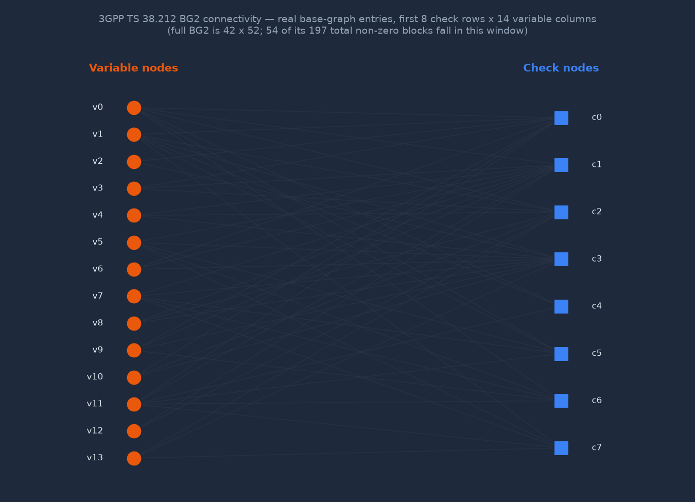

# Systems & Mathematical Architecture: syndrome

syndrome is a multi-architecture Forward Error Correction (FEC) study written
in pure Rust. It follows the 3GPP Release 15/16 5G New Radio (NR) specification
as a learning and benchmark reference, exploring whether memory-safe Rust can
match established C++ implementations such as AFF3CT and OpenAirInterface. It
is a portfolio/research project, not a production baseband replacement — see
[Current Implementation Status](#current-implementation-status) below for what
is actually implemented today.

## 1. Mathematical Framework: 5G NR QC-LDPC Decoding

5G NR discards legacy Reed-Solomon and convolutional codes for data channels,
mandating Quasi-Cyclic Low-Density Parity-Check (QC-LDPC) codes for their
capacity to approach the Shannon limit under high-concurrency implementations.

An LDPC code is defined by a sparse parity-check matrix $H$ of size $M \times
N$. In QC-LDPC, $H$ is structured into blocks of shifted identity matrices of
size $Z \times Z$ (the lifting size), dictated by Base Graph 1 (BG1, for
large/high-rate transport blocks) or Base Graph 2 (BG2, for smaller blocks).
Each non-zero block is a *circulant permutation matrix* — the $Z \times Z$
identity matrix cyclically shifted by an amount that depends on both the
block's position and the lifting size — so the base graph itself is really a
compact statement of which $Z \times Z$ blocks of $H$ are non-zero at all; the
shift values live in a separate table indexed by lifting-size set.

That non-zero pattern is a bipartite graph between $N$ variable nodes (coded
bits) and $M$ check nodes (parity equations), traditionally drawn as a Tanner
graph [4]. The rendering below is not illustrative — it is generated by
[`bench/dashboard/gen_tanner_graph.py`](bench/dashboard/gen_tanner_graph.py)
directly from [`data/bg_tables.json`](data/bg_tables.json), the same
3GPP-spec-derived table the crate compiles into `BG2_ENTRIES` at build time
(see `build.rs`), filtered to a small legible corner (the full BG2 is
$42 \times 52$ blocks; drawing all of it produces an unreadable smear):



Every edge above is a genuine non-zero entry of the real base graph, not a
schematic. Regenerate with `python bench/dashboard/gen_tanner_graph.py`.

### The Layered Offset Min-Sum (LOMS) algorithm

To minimize latency and maximize L1 cache data reuse, syndrome implements the
Layered Offset Min-Sum (LOMS) approximation of belief propagation. The
decoding space is processed one sub-matrix row (layer) at a time.

Let $L_n$ be the input log-likelihood ratio (LLR) from the channel
demodulator. The extrinsic memory space consists of check-to-variable
messages $R_{m,n}$ and variable-to-check messages $Q_{m,n}$. For each layer
(row block $m$), the update equations run sequentially:

**Variable message update:**
$$Q_{m,n}^{(t)} = L_{n}^{(t-1)} - R_{m,n}^{(t-1)}$$

**Check message update (min-sum with offset $\beta$):**
$$R_{m,n}^{(t)} = \prod_{n' \in \mathcal{N}(m) \setminus n} \text{sign}\left(Q_{m,n'}^{(t)}\right) \times \max\left( \min_{n' \in \mathcal{N}(m) \setminus n} \left|Q_{m,n'}^{(t)}\right| - \beta, \; 0 \right)$$

**A posteriori LLR update:**
$$L_{n}^{(t)} = Q_{m,n}^{(t)} + R_{m,n}^{(t)}$$

## 2. Multi-Architecture Hardware Strategy

syndrome targets different vectorization pathways per platform tier:

| Hardware tier | Architecture | Vectorization pathway | Memory constraints |
|---|---|---|---|
| Edge / IoT MCU (Arduino, STM32) | ARM Cortex-M | scalar, `#![no_std]`-compatible core | Zero heap allocations; fixed stack arrays |
| SBC gateway (Raspberry Pi 4/5) | ARM Cortex-A (aarch64) | NEON via `core::arch::aarch64` intrinsics | Thread affinity pinned to performance cores |
| Desktop / cloud RAN (AMD, Intel) | x86_64 | AVX2 via `core::arch::x86_64` intrinsics, runtime-detected | Ring-buffered, cache-line-padded queues |

Both SIMD paths are hand-written intrinsics rather than `core::simd`, because
portable-SIMD requires nightly Rust and this crate builds on stable. See
[Current Implementation Status](#current-implementation-status) for the full
list of what is implemented versus deferred.

### Memory layout for L1/L2 cache efficiency

- **Pre-computed offset tables.** Column indices of the non-zero sub-matrices
  of the base graphs are loaded into static, pre-compiled lookup arrays, so
  the decode loop never recomputes indexing.
- **Struct-of-arrays (SoA) over array-of-structs (AoS).** LLR metrics and
  message structures are partitioned into parallel slices so contiguous
  `f32` runs load directly into AVX2 or NEON registers with zero-overhead
  pointer offsets.
- **No pointer chasing.** All matrices are flat `[f32; N]` / `&[f32]` — no
  `Vec<Vec<T>>` or `Box<T>` on any computational hot path.

## 3. High-Throughput Job Queue & Synchronization Runtime

To scale linearly with CPU physical cores, syndrome runs an asynchronous,
lock-free task scheduler — the same shape as industrial C++ libraries like
`aff3ct-core`, without their synchronization bottlenecks.

```
Incoming LLR stream ---> [ Atomic ring buffer (SPSC) ] ---> Worker 0 (core-0 affinity)
                       ---> [ Atomic ring buffer (SPSC) ] ---> Worker 1 (core-1 affinity)
                       ---> [ Atomic ring buffer (SPSC) ] ---> Worker N (core-N affinity)
```

**Lock-free atomic rings.** Workers claim work through single-producer
single-consumer (SPSC) rings. Coordination is entirely atomic increments
(`AtomicUsize`) with explicit `Ordering::Acquire`/`Ordering::Release` —
no kernel mutex, no context-switch cost under high-volume streaming.

**Thread pinning & hardware affinity.** In high-throughput baseband
deployments (gNodeB/RAN), context switches are unacceptable. The optional
`affinity` feature (via the `core_affinity` crate) pins worker threads to
distinct physical cores, keeping data local to one cache hierarchy.

## 4. Benchmarking & Cross-Language Analytics

The project ships a reproducible benchmark suite measuring Reed-Solomon
encode throughput in Rust, a byte-identical same-algorithm C++ port, and
Python (`bench/run_all.sh`). Every number comes from running code — a
checksum gate fails the run if any two implementations diverge — and none are
hand-written.

## Current Implementation Status

*(301 tests on x86-64 / 302 on AArch64: 165 unit, 10 integration + media, 31
robustness, 77 doctests — see the [README test-suite section](README.md#4-test-suite)
for the up-to-date breakdown; the count above is a snapshot, that section is
the source of truth.)*

**Real and tested:**

5G NR TS 38.212 transport-block chain (complete):
- CRC-24A/B/C, CRC-16/11/6 (`src/crc.rs`) — all §5.1 generator polynomials, bit-serial LFSR
- Code-block segmentation + BG selection (`src/segmentation.rs`) — §5.2.2; $K'$, $Z$, $n_\text{filler}$
- QC-LDPC `encode_5g`/`decode_5g` (`src/qc_ldpc.rs`) — filler $+\infty$ LLR, 2-column puncturing
- Rate matching + HARQ (`src/rate_matching.rs`, `src/harq.rs`) — §5.4.2.1-2; RV $k_0$; soft combining
- `DlSchEncoder`/`DlSchDecoder` (`src/transport_block.rs`) — full TB chain end-to-end

FEC cores:
- Hamming(7,4) encode/decode (`src/hamming.rs`)
- Extended Golay(24,12,8) (`src/golay.rs`) — syndrome-table 3-error correction, weight enumerator verified
- BCH(255,k,t≤10) over GF(2⁸) (`src/bch.rs`) — Berlekamp–Massey + Chien search
- Reed-Solomon erasure encoder/decoder (`src/reed_solomon.rs`) — GF(256), 0x11D, AVX2 VPSHUFB path
- Rate-1/2 K=7 Viterbi decoder (`src/viterbi.rs`) — hard (Hamming ACS) + soft (max-log-MAP)
- LTE rate-1/3 Turbo (`src/turbo.rs`) — TS 36.212 QPP interleaver, iterative max-log-MAP
- Polar codes SC + CA-SCL (`src/polar.rs`) — 3GPP reliability sequence + polarization-weight fallback
- Wi-Fi 6/7 (802.11ax/be) LDPC — real Annex R/F matrices (`src/wifi.rs`, `src/wifi_ldpc_tables.rs`)
- 7 runnable teaching examples (`examples/`) + an all-algorithm benchmark exporter

QC-LDPC kernel:
- BG1 ($Z=384$) and BG2 ($Z=128$) from 3GPP TS 38.212
- Scalar, AVX2 (runtime-detected), and NEON (compile-gated, aarch64) inner-loop paths, each
  proven equivalent to the scalar reference by randomized round-trip tests
- Syndrome-check early termination (exits before `max_iters` once all parity checks pass)

Concurrency:
- SPSC lock-free ring buffer (`src/spsc_queue.rs`) — cache-line-padded head/tail, no false sharing
- `LdpcPipeline` multi-worker (`src/ldpc_pipeline.rs`) — worker count from `available_parallelism()`
- i8 LLR quantization (`src/quantize.rs`) — scale + clamp to $[-127, 127]$

**Aspirational / deferred — not implemented:**
- i8 (rather than f32) LOMS decode path, and an AVX2 8-bit kernel over it
- `#![no_std]` Cortex-M build — the crate requires `std` today (threads,
  `Vec`-based construction), and declares no feature flag implying otherwise
- `core::simd` portable-SIMD path — it requires nightly Rust, so the SIMD
  kernels here are hand-written `core::arch` intrinsics instead
- AVX-512 kernels — no AVX-512 code exists in this crate; do not infer support
  from the AFF3CT comparison in the README's "Similar Projects" table, which
  describes AFF3CT, not this library
- AFF3CT end-to-end comparison on the LDPC path (Phase 2)

## Benchmark Result Schema

`bench/results/<lang>.json` — one JSON record per (lang, impl, shard_len):

```json
{"lang":"rust","impl":"encode_into","shard_len":1024,"data_shards":10,
 "parity_shards":4,"payload_bytes":10240,"ns_per_iter":1465.0,"mib_per_s":682.3}
```

Fields:
- `lang`: `"rust"` | `"cpp"` | `"python_same_algo"` | `"python_reedsolo"`
- `impl`: encoder variant name
- `shard_len`: bytes per data shard
- `payload_bytes`: `data_shards * shard_len`
- `ns_per_iter`: mean nanoseconds per encode call (wall-clock, warm)
- `mib_per_s`: `payload_bytes / ns_per_iter * 1e9 / 1048576`

All numbers are produced by `bench/run_all.sh`, which runs the Rust, C++, and
Python drivers and validates byte-identical parity output via a checksum gate
before writing any results. Numbers are never hand-written.
